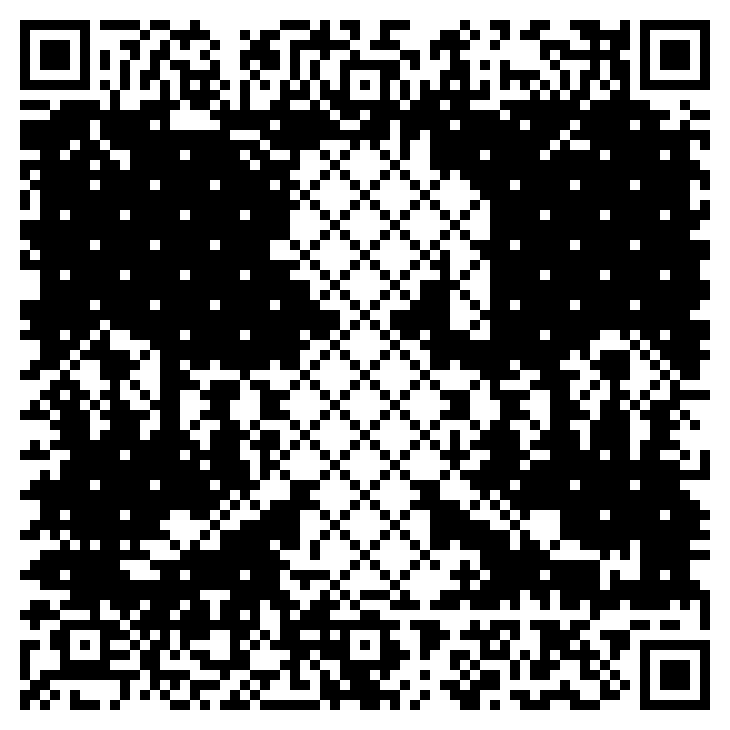
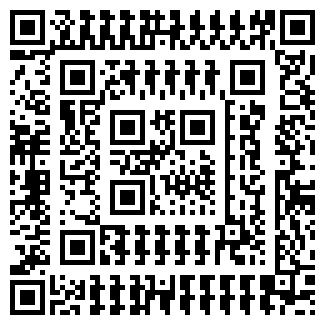
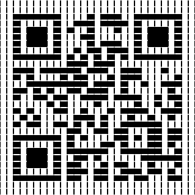
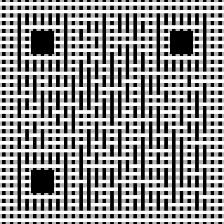
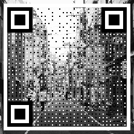
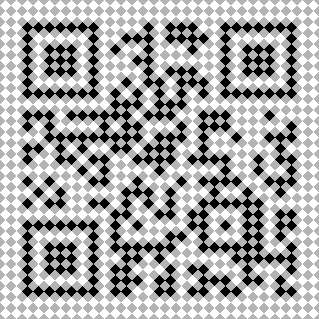
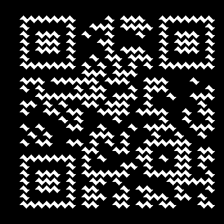
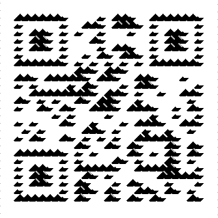

# fuqr

feeling unemployed qr code generator

## Usage

```rs
let qr_code = generate("https://github.com/zhengkyl/fuqr", &QrOptions::new()).unwrap();
```

This is what `QrOptions::new()` looks like.

```rs
QrOptions {
    min_version: Version(1),
    strict_version: false,
    min_ecl: ECL::Low,
    strict_ecl: false,
    mode: None, // None = automatically determined
    mask: None, // None = automatically determined
}
```

`generate()` has two possible errors.

`QrError::InvalidEncoding` occurs if `Mode::Numeric` or `Mode::Alphanumeric` is specified and the input string contains invalid characters. `None` or `Mode::Byte` will not error.

`QrError::ExceedsMaxCapacity` is what it sounds like, but unless `strict_version` is set to true, this is very hard to trigger. The lower limit is exceeding 1273 characters with `Mode::Byte` and `ECL::High`. See [capacity table](https://www.thonky.com/qr-code-tutorial/character-capacities) for specifics.

### QArt Codes

Based on Russ Cox's [QArt codes](https://research.swtch.com/qart) with one improvement. The decoded message doesn't contain extra garbage data, because only the padding bits are manipulated.

This improved process was first published in [Expansion of Image Displayable Area in Design QR Code
and Its Applications, 2011](https://www.ieice.org/publications/conferences/summary.php?id=FIT0000009019&expandable=2&ConfCd=F&session_num=4V&lecture_number=O-006&year=2011&conf_type=F) which actually predates QArt codes. (I only just found this so my implementation differs (not as good) from the method described.)

```rs
let version = Version::new(13);
let qr_width = version.0 * 4 + 17;
let pixel_weights = vec![WeightPixel::new(false, 0); qr_width * qr_width];
let qr_code = generate_qart(
    "https://github.com/zhengkyl/fuqr",
    &QrOptions::new().min_version(version),
    &pixel_weights
).unwrap();
```

`generate_qart()` has the same errors as `generate()` along with `QartError::InvalidPixelWeights` if the size of `pixel_weights` doesn't match the size of the QR code matrix.

### Advanced Usage

```rs
// This returns None if input string exceeds max capacity
let data = Data::new(
    "https://github.com/zhengkyl/fuqr",
    Mode::Byte,
    Version(1), // minimum Version
    ECL::Low, // minimum ECL
).unwrap();
// OR
let data = Data::new_verbose(
    "https://github.com/zhengkyl/fuqr",
    Mode::Byte,
    Version(1),
    true, // strict Version
    ECL::Low,
    true, // strict ECL
).unwrap();

// Pass None to determine and use "best" mask
let qr_code = QrCode::new(data, Some(Mask::M1));
```

The encoding `Mode` must be specified and no errors are thrown if it's invalid. This is fine because it's probably always `Mode::Byte`.

The `strict` arguments force `Version` and `ECL` to not upgrade. There is no real usecase for this.

```rs
// data from above
let mask = Mask::M0;
let bit_info = BitInfo::new(data.mode, data.version, data.ecl, mask);
```

`BitInfo` is like `QrCode`, but it stores the role of each bit/pixel for the specified `Mode`, `Version`, `ECL`, `Mask` combination. Specifically for data pixels, it tracks whether it is a data, error correction, or remainder bit, as well as its error correction block and index within said block.

### NOTE

- MASK SCORING IS (probably) NOT IMPLEMENTED CORRECTLY
  - I haven't bothered fixing the code, because it's annoying and probably pointless.

## Examples

All example code is WIP and in a very unpolished state.

### `/examples/bad_apple.rs`

Animated QArt codes.

| [Naive (low scannability)](https://youtu.be/1ems029Rln4)                            | [Patterns + Low FPS](https://youtu.be/8HG8HJ7tbO8)                                  |
| ----------------------------------------------------------------------------------- | ----------------------------------------------------------------------------------- |
| [](https://youtu.be/1ems029Rln4) | [](https://youtu.be/8HG8HJ7tbO8) |

```sh
# place video at ./examples/bad_apple/bad_apple.mp4
# i'm using the 3:40 one

# generates frames in ./examples/bad_apple/frames
cargo run --example bad_apple

# combines frames into mp4
ffmpeg -framerate 5 -pattern_type glob -i 'examples/bad_apple/frames/*.png' -c:v libx264 -pix_fmt yuv420p -vf "scale=iw*10:ih*10:flags=neighbor" frames.mp4

# combines frames with audio
ffmpeg -i frames.mp4 -i examples/bad_apple/bad_apple.mp4 -map 0:v:0 -map 1:a:0 -c:v copy -c:a aac -shortest out.mp4
```

### `/examples/nesting.rs`

| Nesting dolls                                | Donut holes                                    |
| -------------------------------------------- | ---------------------------------------------- |
|  |  |

The "nesting dolls" is just QArt codes applied recursively. This seems to work best with only one layer of nesting though, because middle layers are hard to scan.

The "donut holes" is the same technique as in the layering examples. As explained in this paper, [Dual-Message QR Codes](https://www.mdpi.com/1424-8220/24/10/3055), a scanner only uses the center pixel of each square, but from a distance this center pixel represents a larger area. Thus the decoded message depends on scanning distance.

### `/examples/scale.rs`

Scaling modules based on position.

| Circle                                 | Stripes                                  | Waves                                |
| -------------------------------------- | ---------------------------------------- | ------------------------------------ |
|  |  |  |

### `/examples/weave.rs`

No need to stick to a boring pixel grid.

| Thick                                | Thin                               | Diagonal                               |
| ------------------------------------ | ---------------------------------- | -------------------------------------- |
|  |  |  |

### `/examples/layers.rs`

Layering is neat, but it can seriously degrade scanning ability if done without care.

See [Halftone QR Codes](https://cgv.cs.nthu.edu.tw/projects/Recreational_Graphics/Halftone_QRCodes), [Micrography QR Codes](https://cgv.cs.nthu.edu.tw/projects/Recreational_Graphics/MQRC), [Amazing QR](https://github.com/x-hw/amazing-qr) for more thoughtful implementations with high scannability.

| Background                                      | Minimalist                         | Improved scannability                  |
| ----------------------------------------------- | ---------------------------------- | -------------------------------------- |
|  |  |  |

### Misc bugs and experiments

| Have                                        | Some                                      | More                            |
| ------------------------------------------- | ----------------------------------------- | ------------------------------- |
|    |  |  |
|  |     |                                 |

## Other

- Great QR code generator tutorial
  - https://www.thonky.com/qr-code-tutorial/
- Reference generator implementations
  - https://github.com/erwanvivien/fast_qr
  - https://github.com/unjs/uqr
- Reference scanner implementations
  - https://github.com/zxing/zxing
  - https://github.com/opencv/opencv_contrib/tree/4.x/modules/wechat_qrcode (fork of zxing-cpp)

### Benchmarks

My benchmarks seem to vary ~30% from run to run. My takeaway is that `fuqr` is kinda slow, but this is probably not the bottleneck.

| Test     | Implementation | Time               | Compared to `fast_qr` |
| -------- | -------------- | ------------------ | --------------------- |
| **V03H** | fuqr           | 71.225 - 73.230 µs | ~1.01x slower         |
|          | qrcode         | 541.65 - 569.61 µs | ~7.8x slower          |
|          | fast_qr        | 70.581 - 72.627 µs | 1.0 (Fastest)         |
| **V10H** | fuqr           | 365.81 - 372.89 µs | ~1.4x slower          |
|          | qrcode         | 2.2897 - 2.3480 ms | ~8.7x slower          |
|          | fast_qr        | 262.86 - 270.61 µs | 1.0 (Fastest)         |
| **V40H** | fuqr           | 3.0942 - 3.1684 ms | ~1.3x slower          |
|          | qrcode         | 21.502 - 21.952 ms | ~8.8x slower          |
|          | fast_qr        | 2.4293 - 2.4919 ms | 1.0 (Fastest)         |
