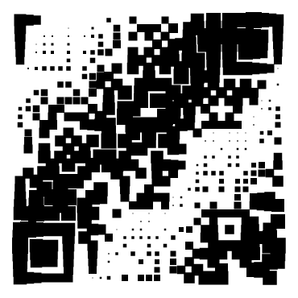
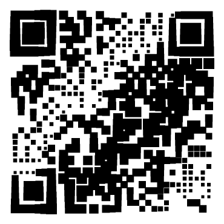

# fuqr

free underwater qr codes

## Examples

### Scaling individual modules

| Barbershop pole | Waves | More waves |
| -- | -- | -- |
|  | | |

## references

https://www.thonky.com/qr-code-tutorial/

https://github.com/erwanvivien/fast_qr

https://github.com/unjs/uqr
