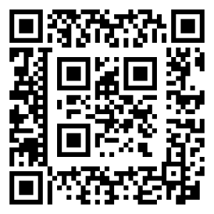
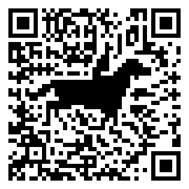
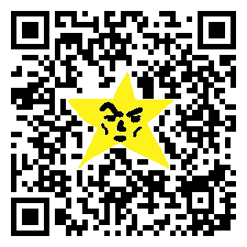
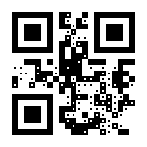
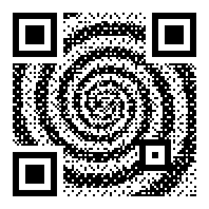
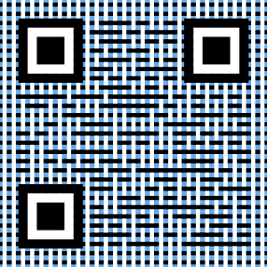
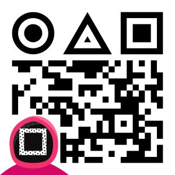

# fuqr

A small and hackable QR code generator

`typescript/` contains the main implementation with support for pixel art and fitted logos included in the extras directory.

`rust/` contains a dependency-free and heap-free port of the Typescript core.

## Examples

This library only contains code to render regular QR codes, but it provides an extendable core that enables the examples below.

These examples are for fun. Only regular QR codes should be used for real applications. 

### Pixel Art

The position of black and white pixels can be forced using math. See the [Pixel Art Solver](#Pixel-art-solver) section below.

| [`examples/recursive.ts`](examples/recursive.ts) | [`examples/horse.ts`](examples/horse.ts) |
| ------------------------------------------------ | ---------------------------------------- |
|    |    |

### Fitted Logo

It's trivial to make the pixels fit around a logo, but by using the shape to exactly calculate introduced errors, the logo can be slightly bigger.

| [`examples/nonsquare.ts`](examples/nonsquare.ts) | [`examples/wordmark.ts`](examples/wordmark.ts) |
| ------------------------------------------------ | ---------------------------------------------- |
|    |    |

This can cover less area than the pixel art method, but this works even if the entire logo is decoded wrong, so safer for arbitrary shaped/colored designs.

### Overlaid

When scanned, squares are decoded as black/white based on the image pixel(s) near the estimated center of each square. As a result, correctly colored square centers can simply be overlaid on any background.

See [Halftone QR Codes](https://cgv.cs.nthu.edu.tw/projects/Recreational_Graphics/Halftone_QRCodes) and [Micrography QR Codes](https://cgv.cs.nthu.edu.tw/projects/Recreational_Graphics/MQRC) for work based on this idea.

| [`examples/nesting.ts`](examples/nesting.ts) | [`examples/dithering.ts`](examples/dithering.ts) |
| -------------------------------------------- | ------------------------------------------------ |
|    |    |

Downscaling the background and applying a dithering effect looks especially good.

### Designer

See https://github.com/zhengkyl/qrframe for a code-based QR code designer with more designed examples.

| [`examples/weave.ts`](examples/weave.ts) | [`examples/squid.ts`](examples/squid.ts) |
| ---------------------------------------- | ---------------------------------------- |
|    |    |

## Background

### Pixel art solver

QR codes use Reed-Solomon (RS) error correction. The black and white pixels represent data, consisting of `k` message symbols and `r` derived error correction symbols. Changing the pixels requires changing the message symbols, but changing the message defeats the purpose. However if the message contents have length `c` shorter than `k`, then `p` padding symbols are added such that `c + p = k`. In practice, these padding symbols can be set arbitrarily.

It is straightforward to control the pixels corresponding to `p` padding symbols, but actually we can choose any mixture of `p` padding or error correction symbols, and solve for the required unknown padding symbols. This is because RS codes are [Maximum Distance Separable](https://en.wikipedia.org/wiki/Singleton_bound#MDS_codes) and for any arbitrary `k` chosen symbols, there is exactly one matching RS code.

[QArt codes, 2012](https://research.swtch.com/qart) is a great writeup that covers much of the relevant math, although this idea was probably identified independently many times, such as in [Expansion of Image Displayable Area in Design QR Code and Its Applications, 2011](https://www.ieice.org/publications/conferences/summary.php?id=FIT0000009019&expandable=2&ConfCd=F&session_num=4V&lecture_number=O-006&year=2011&conf_type=F).

Error can be introduced to place more pixels. Standard QR code decoding can correct up to `⌊r / 2⌋` incorrect symbols at unknown locations. This allows placing pixels anywhere, but since it is half as efficient as the "solve for padding" process above, this should only be used for forcing pixels corresponding to the message content or when more than `p` symbols need to be placed.

## Undocumented knowledge

- Byte mode is UTF-8.

- The mask scoring step is unnecessary. The best mask is unambiguously `2` (vertical stripes), but even the worst mask, `0` (checkboard), has no discernible impact on scannability.

- When calculating error correction capacity, there is no need to account for misdecode protection for Version 1 Low, Medium and Version 2 Low.

- The timing patterns are not used. Only the bottom right alignment pattern is used although scanning can succeed without it, especially on smaller codes.